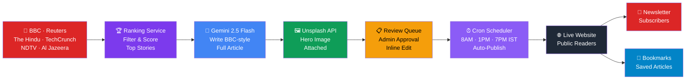

<div align="center">


<br/>


<br/><br/>

<a href="https://github.com/26Utkarsh/InkWire"></a>
&nbsp;

&nbsp;

&nbsp;

&nbsp;

&nbsp;


<br/><br/>


</div>

<br/>

---

<div align="center">

## 💀 The Problem

</div>

```
Running a news website means:

  → Finding stories manually         (2 hrs/day)
  → Writing full articles            (3 hrs/day)
  → Finding images + formatting      (1 hr/day)
  → Publishing + scheduling          (1 hr/day)
  → Sending newsletters              (30 min/day)
                                     ───────────
                                     7.5 hrs wasted · every single day
```

<div align="center">

### ⚡ InkWire does all of this automatically. Every day. While you sleep.

</div>

<br/>

---

<div align="center">

## 🧠 How InkWire Works


</div>



<br/>

---

<div align="center">

## ✨ Features

</div>

<table>
<tr>
<td align="center" width="33%">
<br/>
<b>🤖 AI Writing Engine</b><br/>
Gemini 2.5 Flash writes full BBC-style long-form articles. Groq LLaMA 70B as fallback. Zero human writing needed.
</td>
<td align="center" width="33%">
<br/>
<b>📡 Smart News Crawler</b><br/>
Aggregates 7+ premium RSS feeds globally and in India. Ranks, filters noise, picks only what matters.
</td>
<td align="center" width="33%">
<br/>
<b>⏰ Auto-Publish Cron</b><br/>
3 scheduled publish slots daily — 8AM, 1PM, 7PM IST. Fully automated. No manual intervention.
</td>
</tr>
<tr>
<td align="center" width="33%">
<br/>
<b>📊 Editorial Dashboard</b><br/>
Real-time control room with live stats, article queue, bulk approve/reject, and system health panel.
</td>
<td align="center" width="33%">
<br/>
<b>🔒 Security Hardened</b><br/>
HttpOnly JWT cookies, CSRF protection, rate limiting, CSP headers, mass assignment protection. XSS-proof.
</td>
<td align="center" width="33%">
<br/>
<b>💰 AdSense Ready</b><br/>
Built to pass Google AdSense review. Privacy policy, about, terms pages included. Ad slots activate with one env var.
</td>
</tr>
</table>

<br/>

---

<div align="center">

## 🛠️ Tech Stack


</div>

<br/>

<div align="center">

| Layer | Technology | Details |
|:---:|:---:|:---|
| ⚛️ **Frontend** | React 18 + Vite 5 | BBC-inspired layout, Playfair Display, dark/light adaptive |
| 🎨 **Styling** | Vanilla CSS + CSS Variables | GPU-accelerated animations, mobile-first, 320px → 1400px+ |
| ⚙️ **Backend** | Node.js + Express 4 | REST API, modular services, cron scheduler |
| 🗄️ **Database** | MongoDB Atlas (Mongoose) | Articles, admin, newsletter subscribers |
| 🤖 **AI Primary** | Google Gemini 2.5 Flash | Full article writing, SEO optimization |
| 🔄 **AI Fallback** | Groq LLaMA 70B | Auto-switches if Gemini fails |
| 🔐 **Auth** | JWT in HttpOnly Cookie | XSS-proof, bcrypt password hashing |
| 🖼️ **Images** | Unsplash API | Auto hero images for every article |
| 📧 **Email** | Nodemailer (Gmail SMTP) | Newsletter dispatch + admin notifications |
| 🚀 **Hosting** | Render + Netlify | Backend + frontend, CI/CD on push |

</div>

<br/>

---

## 🚀 Quick Start

### 1. Clone
```bash
git clone https://github.com/26Utkarsh/InkWire.git && cd InkWire
```

### 2. Backend `.env`
```env
MONGODB_URI=your_mongodb_atlas_uri
JWT_SECRET=your_hex_secret
JWT_EXPIRES_IN=8h
ADMIN_EMAIL=your@email.com
ADMIN_PASSWORD=your_password
GEMINI_API_KEY=your_gemini_key
GROQ_API_KEY=your_groq_key
NEWS_API_KEY=your_newsapi_key
UNSPLASH_ACCESS_KEY=your_unsplash_key
EMAIL_USER=your@gmail.com
EMAIL_PASS=your_app_password
FRONTEND_URL=http://localhost:5173
```

### 3. Run
```bash
# Backend
cd backend && npm install && npm run dev

# Frontend (new terminal)
cd frontend && npm install && npm run dev
```

> Frontend → `http://localhost:5173` · Admin → `http://localhost:5173/admin/login`

<br/>

---

<div align="center">

## 📁 Structure

</div>

```
InkWire/
│
├── 📁 backend/
│   ├── ⚙️  config/          # DB, sources, topics, AI prompts
│   ├── 🎮 controllers/      # Auth, Admin, Article, Newsletter
│   ├── 🛡️  middleware/       # JWT, CSRF, rate limits, validation
│   ├── 📦 models/           # Admin · Article · Newsletter schemas
│   ├── 🛣️  routes/           # REST route mounting
│   ├── 🤖 services/         # NewsService · AIService · ImageService
│   │                        # EmailService · RankingService · SchedulerService
│   └── 🔧 utils/            # Logger, sanitizer, readTime, slugify
│
└── 📁 frontend/
    └── src/
        ├── 🧩 components/   # ArticleCard · Navbar · BookmarkButton · AdSlot
        ├── 📱 pages/        # Home · Article · Topic · Search · Saved · Admin
        ├── 🪝 hooks/        # useAdmin · useArticleDetail
        ├── 🏪 store/        # Zustand — auth + bookmarks (localStorage)
        └── 🎨 styles/       # variables · reset · typography · animations
```

<br/>

---

<div align="center">

## 🗺️ Roadmap

</div>

```
████████████████████████████████████████████████████  COMPLETE ✅

  ✅ Smart crawler — 7+ RSS feeds globally + India
  ✅ Gemini 2.5 Flash article writing + Groq fallback
  ✅ 3x daily auto-publish cron (8AM · 1PM · 7PM IST)
  ✅ Editorial dashboard — queue, approve, reject, edit
  ✅ Bookmark system with localStorage persistence
  ✅ Newsletter dispatch via Nodemailer
  ✅ HttpOnly JWT + CSRF + rate limiting + CSP
  ✅ AdSense-ready structure
  ✅ Brotli/Gzip + code splitting + lazy loading
  ✅ Wikipedia import + custom article generator
  ✅ Deployed: Render (backend) + Netlify (frontend)

░░░░░░░░░░░░░░░░░░░░░░░░░░░░░░░░░░░░░░░░░░░░░░░░░░░  COMING 🚧

  ○ Reader accounts + personalized feed
  ○ Comment system with moderation
  ○ SEO sitemap + structured data (JSON-LD)
  ○ PWA — offline reading
  ○ Multi-language article generation
```

<br/>

---

<div align="center">


<br/>

**[🚀 Live Demo](https://github.com/26Utkarsh/InkWire)** &nbsp;·&nbsp; **[🐛 Report Bug](https://github.com/26Utkarsh/InkWire/issues)** &nbsp;·&nbsp; **[💡 Request Feature](https://github.com/26Utkarsh/InkWire/issues)**

<br/>

Built by [**26Utkarsh**](https://github.com/26Utkarsh)


</div>
