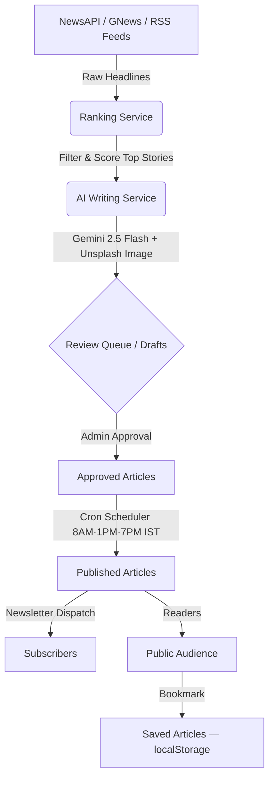

# 📰 InkWire — AI-Powered News Publishing Platform

<p align="center">
  
  
  
  
  
  
</p>

<p align="center">
  <i>"The world's most important stories — automated, reviewed, and published."</i>
</p>

---

InkWire is a **production-ready, fully automated AI-driven news publishing platform**. It fetches global and Indian headlines daily, employs Google Gemini 2.5 Flash to write full-length SEO-optimized articles, provides a premium editorial dashboard for review and manual override, and publishes on a daily cron schedule — with built-in AdSense monetization, newsletter dispatch, and a bookmark system for readers.

---

## 🔍 Visual Workflow & Data Flow



---

## ⚡ Key Features

### 🤖 AI & Content Pipeline
- **Smart News Crawler** — Aggregates headlines across 7+ high-profile RSS feeds (BBC, Reuters, The Hindu, TOI, TechCrunch, NDTV, Al Jazeera) and global APIs
- **LLM Editorial Engine** — Google Gemini 2.5 Flash (primary) + Groq LLaMA 70B (fallback) write fully structured, long-form, BBC-style articles
- **Wikipedia Import Mode** — Admin can search and rewrite any Wikipedia article into a news draft via AI
- **Custom Article Generator** — Admin can write a topic prompt and have the AI generate a full article draft on demand
- **Direct Clipboard & Gallery Uploads** — Paste images (`Ctrl+V`) directly into the prompt box or select them from your device's native gallery (fully responsive on both desktop and mobile viewports)
- **Multi-Image Custom Drafts** — Provide a Main featured image plus a Second inline image, which the AI dynamically inserts in the middle of the article body with custom styled styling
- **Quill Rich-Text Inline Image Support** — Edit drafts inside the Review Queue and drop multiple images directly into the body at the cursor position (saved as base64 URLs)
- **Smart Image Credit Filtering** — Automatically hides system attribution strings (like `"Uploaded from device"` or `"Pasted from clipboard"`) on public pages while preserving custom source names (e.g., `"Reuters"`)
- **Live News Suggestions** — Dashboard shows curated trending headlines from live feeds as one-click generation prompts

### 🎨 Frontend (React 18 + Vite 5)
- **BBC-Inspired Article Layout** — Premium reading experience with Playfair Display serif, hero image, byline, "At a Glance" bullet points
- **🔖 Bookmark System** — Save any article locally with localStorage persistence; dedicated `/saved` reading list page
- **Glassmorphic Search Modal** — Full-screen search overlay with keyboard navigation
- **Dark/Light Adaptive** — Respects system `prefers-color-scheme`
- **Smooth Animations** — GPU-accelerated micro-animations with `will-change` hints and `prefers-reduced-motion` support
- **Mobile-First Responsive** — Fluid layouts from 320px to 1400px+; full-bleed article images on mobile

### 📊 Editorial Dashboard
- **Real-Time Control Room** — Live IST clock, today's stats (approved, rejected, pending, views)
- **Article Queue** — Review AI drafts with inline editing, bulk approve/reject, slot scheduling
- **Published Manager** — Unpin, unpublish, delete, or toggle featured hero story
- **Manual Publishing Console** — Force-publish Morning / Afternoon / Evening slots instantly
- **System Health Panel** — Live status for AI model, database, and email dispatcher

### 🛡️ Security
- **HttpOnly Cookie JWT** — Token stored in `HttpOnly`, `Secure`, `SameSite=Strict` cookie — fully XSS-proof
- **Mass Assignment Protection** — Strict DTO allow-lists on every editorial endpoint
- **CSRF Protection** — Origin/Referer validation middleware on all mutating API calls
- **Rate Limiting** — Auth endpoint and global API rate limiters
- **Hardened CSP** — Content Security Policy with `frame-ancestors: none`, `formAction: self`

### 🚀 Performance (2025 Optimizations)
- **Code-Split Bundles** — Manual Rollup chunks: `vendor-react`, `vendor-router`, `vendor-data`, `vendor-quill` — Quill editor never loaded on public pages
- **Brotli + Gzip Compression** — Pre-compressed `.br` / `.gz` assets at build time
- **Resource Hints** — `preconnect` for Google Fonts, `dns-prefetch` for Unsplash CDN
- **Font Optimization** — `display=swap` (no FOIT) + `subset=latin` (40% smaller font files)
- **GPU-Accelerated Animations** — All animated elements use `will-change: transform, opacity`
- **Lazy Loading** — Admin pages and non-critical routes are `React.lazy()` code-split
- **Terser Minification** — 2-pass compression, `drop_console: true`, zero comments in output
- **300ms Touch Delay Removed** — `touch-action: manipulation` on all elements for instant mobile tap

---

## 🛠️ Quick Start

### 1. Clone & Setup Backend

```bash
git clone https://github.com/26Utkarsh/InkWire.git
cd InkWire

# Configure backend environment variables
cd backend
cp .env.example .env
# Edit .env and supply your API keys (see Environment Reference below)

# Install dependencies and start development server
npm install
npm run dev
```

### 2. Setup Frontend

```bash
# In a new terminal tab
cd frontend
npm install
npm run dev
```

Open **[http://localhost:5173](http://localhost:5173)** in your browser.

> **Admin Dashboard:** [http://localhost:5173/admin/login](http://localhost:5173/admin/login)

---

## 📋 Environment Variables Reference

Create a `.env` file inside the `backend/` directory:

| Variable | Required | Description |
| :--- | :---: | :--- |
| `MONGODB_URI` | **Yes** | MongoDB Atlas connection URI |
| `JWT_SECRET` | **Yes** | Hex string used to sign JWT sessions |
| `JWT_EXPIRES_IN` | **Yes** | Token expiry (default: `8h`) |
| `ADMIN_EMAIL` | **Yes** | Login email for the Editorial Control Room |
| `ADMIN_PASSWORD` | **Yes** | Login password (bcrypt-hashed on first startup) |
| `GEMINI_API_KEY` | **Yes** | Google AI Studio key (Gemini 2.5 Flash) |
| `GROQ_API_KEY` | *Optional* | Groq API key — used as LLM fallback writer |
| `NEWS_API_KEY` | **Yes** | newsapi.org key for headline extraction |
| `GNEWS_API_KEY` | *Optional* | GNews.io key for broader headline coverage |
| `UNSPLASH_ACCESS_KEY` | *Optional* | Unsplash key for article hero images |
| `EMAIL_USER` | *Optional* | Gmail address for newsletter dispatch |
| `EMAIL_PASS` | *Optional* | Gmail App Password (not your account password) |
| `EMAIL_TO` | *Optional* | Admin email for system notifications |
| `FRONTEND_URL` | **Yes** | CORS origin — e.g., `http://localhost:5173` |

---

## 📁 Project Structure

```
InkWire/
├── backend/
│   ├── config/             # DB, sources, topics, AI prompts, constants
│   ├── controllers/        # Auth, Admin, Article, Newsletter controllers
│   ├── middleware/          # JWT verify, CSRF, rate limits, input validation
│   ├── models/             # Mongoose schemas: Admin, Article, Newsletter
│   ├── routes/             # REST route mounting (auth, admin, articles)
│   ├── services/           # NewsService, AIService, ImageService, EmailService
│   │                       # RankingService, SchedulerService
│   ├── utils/              # Logger, HTML sanitizer, readTime calculator, slugify
│   └── server.js           # Express bootstrap — CORS, Helmet, cookie-parser
│
└── frontend/
    ├── src/
    │   ├── components/
    │   │   ├── article/    # ArticleCard, FeaturedCard, ArticleBody, ArticleMeta
    │   │   ├── layout/     # Navbar, Footer, AdminLayout
    │   │   └── ui/         # BookmarkButton, Toast, AdSlot, NewsletterForm
    │   ├── config/         # Axios instance (withCredentials: true)
    │   ├── constants/      # TOPICS array — drives nav, badges, filters
    │   ├── hooks/          # useAdmin (stats/queue), useArticleDetail
    │   ├── pages/
    │   │   ├── admin/      # AdminLogin, AdminDashboard, ArticleQueue,
    │   │   │               # ArticleEditor, Published, AdminSettings
    │   │   └── *.jsx       # Home, ArticlePage, TopicPage, SearchPage,
    │   │                   # SavedPage, ArchivePage, AboutPage, etc.
    │   ├── store/          # Zustand store — auth + bookmarks (localStorage)
    │   ├── styles/         # variables, reset, typography, animations, responsive
    │   └── App.jsx         # Router, lazy-loading, auth guard bootstrapper
    ├── index.html          # Preconnect hints, PWA manifest, OG tags
    └── vite.config.js      # Manual chunks, Brotli/Gzip, Terser, esnext target
```

---

## 🔖 Bookmark System

Readers can save any article to a persistent reading list:

- **On article cards** — hover to reveal a bookmark icon overlay in the image corner
- **On article pages** — pill-shaped Save button in the BBC-style action bar
- **`/saved` page** — full reading list with timestamps, topic labels, and individual remove buttons
- **Navbar badge** — red count badge on the "Saved" nav link when articles are saved
- **Persistence** — stored in `localStorage` under `inkwire_bookmarks` — survives page refreshes and browser restarts; no backend required

---

## 🛠️ Administrative Guides

### Adding a Custom News Source

1. Open [`backend/config/sources.config.js`](./backend/config/sources.config.js)
2. Add your feed:
   ```javascript
   { name: 'My News Feed', url: 'https://example.com/rss.xml', topic: 'technology', credibilityScore: 85 }
   ```
3. The crawler picks it up on the next generation cycle automatically.

### Creating a New Editorial Category

1. Open [`backend/config/topics.config.js`](./backend/config/topics.config.js) and add:
   ```javascript
   { id: 'automotive', label: 'Automotive', color: '#eab308', keywords: ['electric vehicle', 'EV', 'tesla'] }
   ```
2. Add the same entry to [`frontend/src/constants/index.js`](./frontend/src/constants/index.js) — this automatically populates the nav links, topic filters, and article badges.

---

## 💰 AdSense Monetization Guide

InkWire is structured to pass Google AdSense review out-of-the-box:

1. **Generate Volume** — Run the system for 10–14 days to accumulate 20–30 published articles
2. **Submit for Review** — The platform includes compliant [About](./frontend/src/pages/AboutPage.jsx), [Privacy Policy](./frontend/src/pages/PrivacyPage.jsx), and [Terms](./frontend/src/pages/TermsPage.jsx) pages
3. **Activate Ads** — Once approved, set `VITE_ADSENSE_PUBLISHER_ID=ca-pub-XXXXXXXXXXXX` in your deployment env — ad slots activate automatically

---

## 🚀 Deployment Guide

### Backend → Render.com

1. Create a **New Web Service** → connect your GitHub repo
2. Set **Root Directory** to `backend`
3. Add all environment variables in the Render console
4. **Build Command:** `npm install` · **Start Command:** `node server.js`

### Frontend → Netlify

1. **New Site from Git** → select your repo
2. **Base Directory:** `frontend` · **Build Command:** `npm run build` · **Publish Directory:** `dist`
3. Add environment variable: `VITE_API_URL=https://your-backend.onrender.com`
4. Add a `_redirects` file (or use `netlify.toml`) for SPA routing: `/* /index.html 200`

> **Note:** The `netlify.toml` in this repo already handles SPA redirects automatically.

---

## 🧩 Tech Stack

| Layer | Technology |
| :--- | :--- |
| **Frontend** | React 18, Vite 5, React Router 6, Zustand, Axios |
| **Styling** | Vanilla CSS, CSS Custom Properties, Playfair Display + Inter |
| **Backend** | Node.js, Express 4, MongoDB Atlas (Mongoose) |
| **AI** | Google Gemini 2.5 Flash, Groq LLaMA 70B (fallback) |
| **Auth** | JWT in HttpOnly Cookie, bcrypt password hashing |
| **Scheduling** | node-cron (8 AM · 1 PM · 7 PM IST) |
| **Email** | Nodemailer (Gmail SMTP) |
| **Images** | Unsplash API |
| **Deployment** | Render (backend) + Netlify (frontend) |
| **Build Tools** | Vite, Rollup (manual chunks), Terser, Brotli/Gzip compression |

---

*Built with ❤️ using React, Node.js, MongoDB Atlas, and Google Gemini AI.*
