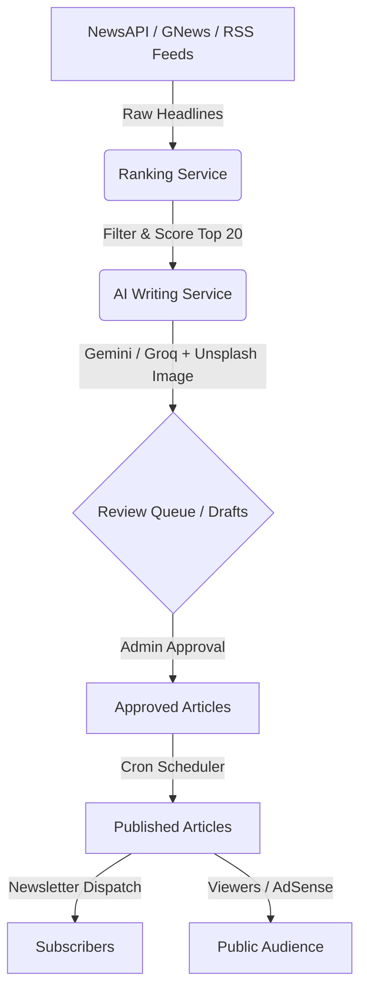

# 📰 InkWire — AI-Powered News Publishing Platform

<p align="center">
  
  
  
  
</p>

> *"The world's most important stories, automated and curated for you."*

InkWire is a production-ready, fully automated AI-driven news publishing platform. It fetches global and local Indian headlines daily, employs advanced LLMs to write full-length, SEO-optimized articles, provides a sleek editorial dashboard for review and manual override, and publishes articles automatically on a daily schedule.

---

## 🔍 Visual Workflow & Data Flow

Below is the architectural flow of how InkWire turns raw headlines into published articles:



---

## ⚡ Key Features

*   **📰 Smart News Crawler**: Fetches and aggregates news across 7 high-profile RSS feeds (BBC, Reuters, The Hindu, TOI, TechCrunch, NDTV, Al Jazeera) and global news search APIs.
*   **🧠 LLM Editorial Engine**: Leverages Google Gemini 1.5 Flash (primary) and Groq LLaMA 70B (fallback) to write fully structured, long-form articles with deep analysis.
*   **🛡️ Hardened Security Core**: 
    *   **Cookie-based JWT Session**: JWT is stored in an `HttpOnly`, `Secure`, `SameSite=Strict` cookie, completely blocking XSS session theft.
    *   **Mass Assignment Protection**: Strict DTO allow-lists for editorial edits.
    *   **Request Validation**: Strict length caps on login and editorial inputs.
    *   **Privacy & Headers**: Hardened Content Security Policy (CSP), clickjacking protection, and a restrictive Permissions-Policy.
*   **📊 Premium Slate-900 Dashboard**: A premium Editorial Control Room styled with HSL slate-dark colors, micro-animations, real-time widgets, and automated publishing control panels.
*   **📦 Google AdSense Ready**: Standardized responsive ad slot containers strategically integrated into article detail layouts.

---

## 🛠️ Quick Start

### 1. Clone & Setup Backend
```bash
# Clone the repository
git clone https://github.com/26Utkarsh/InkWire.git
cd inkwire

# Configure backend environment variables
cd backend
cp .env.example .env
# Edit .env and supply your API keys (see Environment Reference below)

# Install dependencies and start development server
npm install
npm run dev
```

### 2. Setup Frontend
```bash
# In a new terminal tab, navigate to frontend
cd frontend
npm install
npm run dev
```
Open **[http://localhost:5173](http://localhost:5173)** in your browser.

---

## 📋 Environment Variables Reference

Create a `.env` file inside the `backend` directory. Below are the key configuration variables:

| Variable | Required | Description |
| :--- | :---: | :--- |
| `MONGODB_URI` | **Yes** | MongoDB Atlas connection URI |
| `JWT_SECRET` | **Yes** | Hexadecimal string used to sign JWT sessions |
| `JWT_EXPIRES_IN` | **Yes** | Expiration limit for session cookie (default: `15m`) |
| `ADMIN_EMAIL` | **Yes** | Login email for the Editorial Control Room |
| `ADMIN_PASSWORD` | **Yes** | Login password (hashed on initial startup) |
| `GEMINI_API_KEY` | **Yes** | Google AI Studio key (Gemini models) |
| `GROQ_API_KEY` | *Optional* | Groq API Key (used as a backup LLM writer) |
| `NEWS_API_KEY` | **Yes** | newsapi.org API key for headline extraction |
| `UNSPLASH_ACCESS_KEY` | *Optional* | Access key for adding header images to articles |
| `EMAIL_USER` | *Optional* | Gmail address used for sending editorial alerts |
| `EMAIL_PASS` | *Optional* | Gmail App Password (NOT your account password) |
| `EMAIL_TO` | *Optional* | Target email address to receive administrative updates |

---

## 📁 Project Structure

```
inkwire/
├── backend/
│   ├── config/             # DB, sources, topics, and AI prompts configuration
│   ├── controllers/        # Business logic endpoints (Auth, Admin, Articles, Newsletter)
│   ├── middleware/         # Cookie parse, JWT verify, input validates, rate limits
│   ├── models/             # Mongoose schemas (Admin, Article, Newsletter)
│   ├── routes/             # REST route mounting point
│   ├── services/           # Crawlers, AI Writers, Rankers, Email, and node-cron Schedulers
│   ├── utils/              # Loggers, HTML sanitizers, readability analyzers
│   └── server.js           # Server bootstrap entrypoint
│
└── frontend/
    ├── src/
    │   ├── components/     # Layout shells, article lists, UI buttons/badges
    │   ├── config/         # Axios config setup with withCredentials: true
    │   ├── hooks/          # React hooks for administrative fetching
    │   ├── pages/          # Home, Article reader, Search, and Admin panels
    │   ├── store/          # Zustand global store (cookie-driven auth verification)
    │   ├── styles/         # Global styles and responsive CSS variables
    │   └── App.jsx         # App router and session bootstrapper
```

---

## 🛠️ Administrative Guides

### Adding a Custom News Source
1.  Open [backend/config/sources.config.js](file:///C:/Users/itsut/.gemini/antigravity/scratch/inkwire/backend/config/sources.config.js).
2.  Add your feed to the configuration array:
    ```javascript
    { name: 'My News Feed', url: 'https://example.com/rss.xml', topic: 'technology', credibilityScore: 85 }
    ```
3.  Save the changes. The crawler will ingest headlines from this feed on the next auto-generation cycle.

### Creating a New Editorial Category
1.  Open [backend/config/topics.config.js](file:///C:/Users/itsut/.gemini/antigravity/scratch/inkwire/backend/config/topics.config.js).
2.  Add the new topic object:
    ```javascript
    {
      id: 'automotive',
      label: 'Automotive',
      color: '#eab308',
      keywords: ['electric vehicle', 'EV', 'tesla', 'car', 'hybrid', 'concept vehicle']
    }
    ```
3.  Add the same topic metadata to the corresponding constant in `frontend/src/constants/index.js` to automatically render category filters, header navigation links, and tags.

---

## 💰 AdSense Monetization Guide

InkWire is optimized to pass AdSense reviews and start generating passive income out-of-the-box.

1.  **Generate Core Volume**: Allow the system to generate articles for 10-14 days. This gives you the 20-30 published posts required for AdSense approval.
2.  **Submit Site**: Submit your domain to Google AdSense. InkWire provides custom [AboutPage](file:///C:/Users/itsut/.gemini/antigravity/scratch/inkwire/frontend/src/pages/AboutPage.jsx), [PrivacyPage](file:///C:/Users/itsut/.gemini/antigravity/scratch/inkwire/frontend/src/pages/PrivacyPage.jsx), and [TermsPage](file:///C:/Users/itsut/.gemini/antigravity/scratch/inkwire/frontend/src/pages/TermsPage.jsx) templates, satisfying all structural requirements.
3.  **Place Ad IDs**: Once approved, set your publisher key in your deployment dashboard env (`VITE_ADSENSE_PUBLISHER_ID=ca-pub-XXXXXXXXXXXX`). The reactive frontend will automatically begin serving advertisements.

---

## 🚀 Deployment Guide

### Backend: Render.com
1.  Create a **New Web Service** and connect your repo.
2.  Set **Root Directory** to `backend`.
3.  Configure environment variables in the Render console.
4.  Set **Build Command** to `npm install` and **Start Command** to `node server.js`.

### Frontend: Netlify
1.  Create a **New Site from Git** and select your repository.
2.  Set **Base Directory** to `frontend`.
3.  Configure **Build Command** to `npm run build` and **Publish Directory** to `dist`.
4.  Add `VITE_API_URL=https://your-backend-service.onrender.com` as an environment variable.

---

*Built with ❤️ using React, Node.js, MongoDB Atlas, and Google Gemini AI.*
